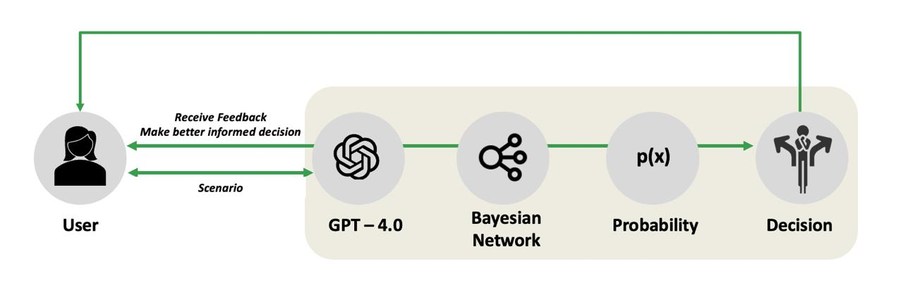
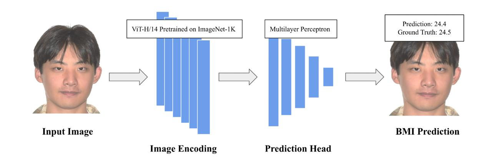
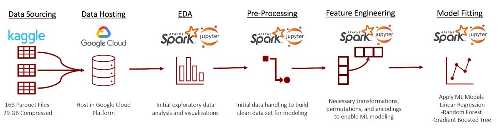
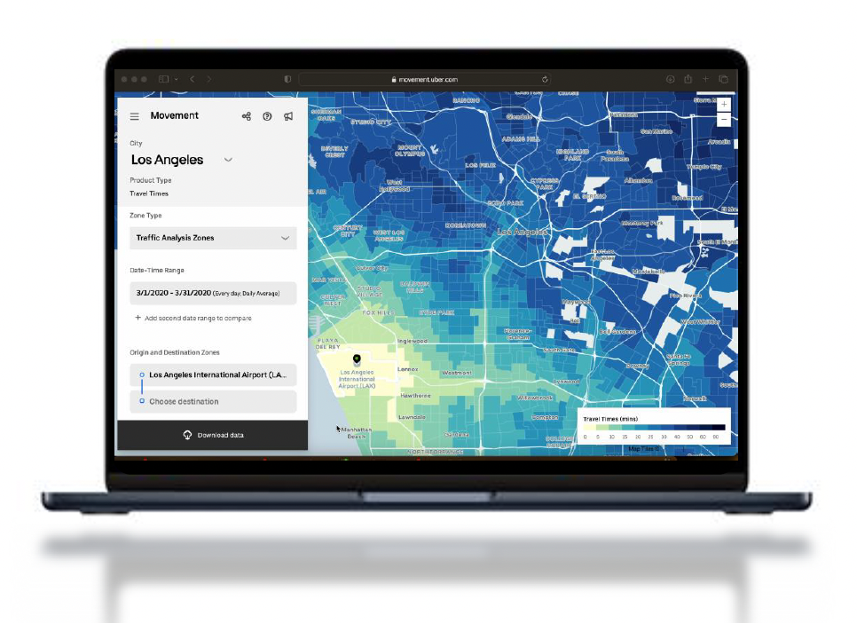
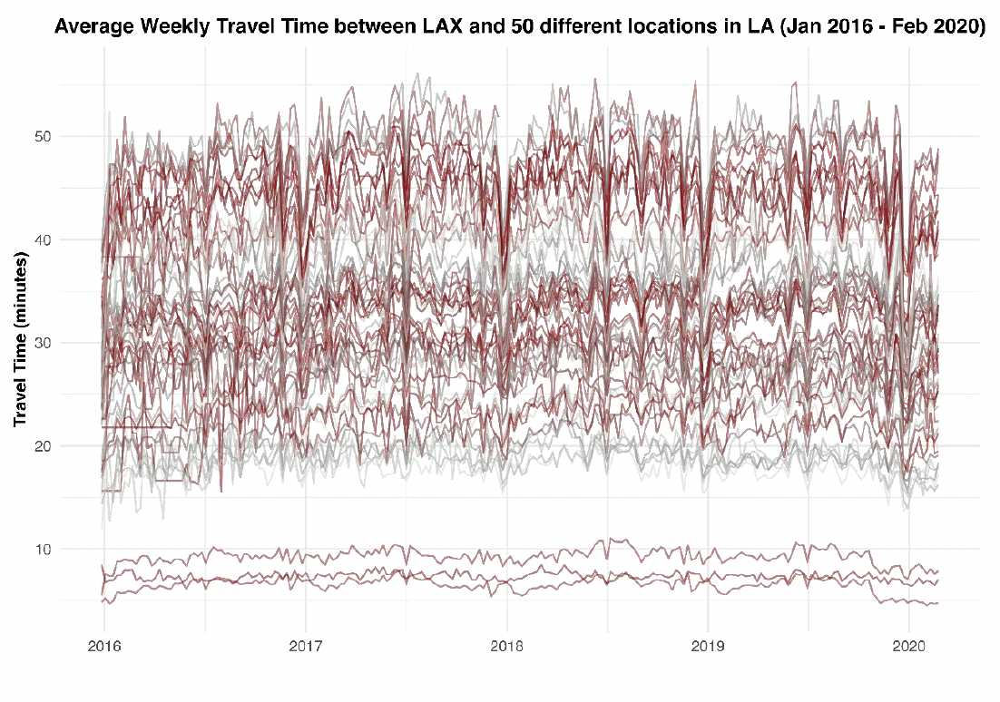
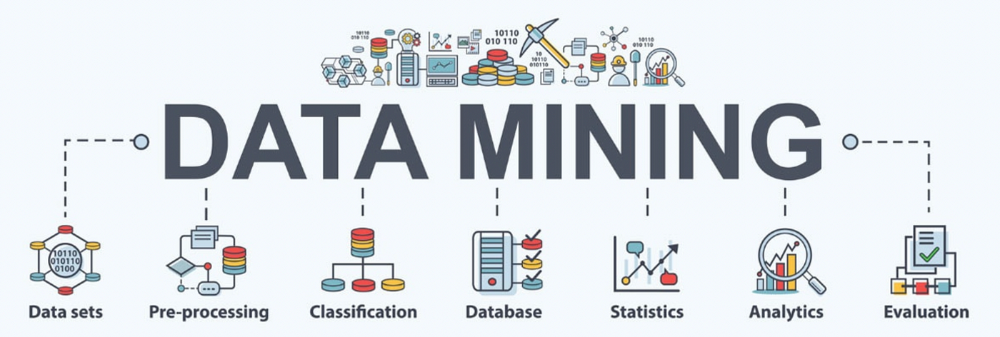
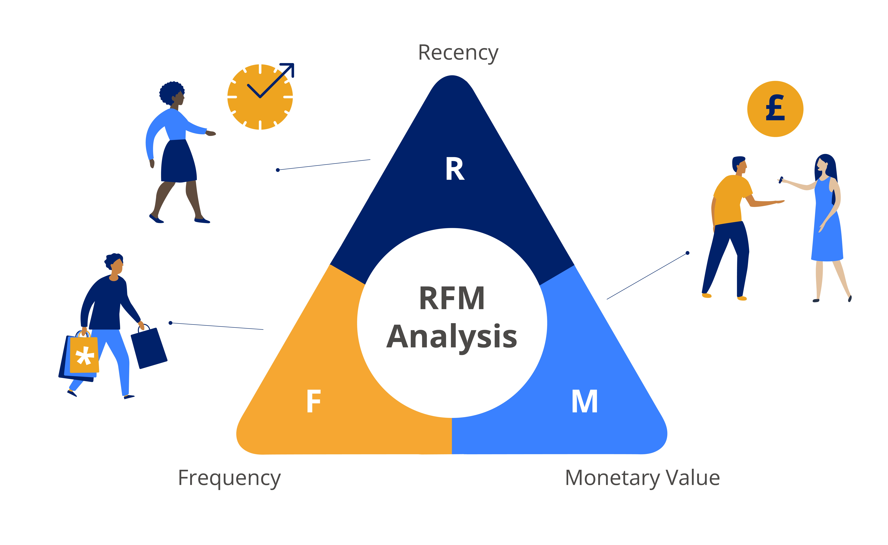

# Portfolio

## Education						       		
### The University of Chicago
#### M.S., Applied Data Science (_December 2023_)
 - 4.00/4.00 CGPA
Courses taken:
 - Statistical Analysis
 - Data Science for Consulting
 - Data Engineering Platforms
 - Data Mining Principles, Linear and Non-Linear Models, 
 - Big Data Platforms
 - Machine Learning
 - Time Series Analysis
 - Natural Language Processing
 - ML Operations
  
### Narsee Monjee Institute of Management Studies
#### B.S., Applied Statistics & Analytics (_May 2021_)

## Skills
- Languages:
  
  
  
  
  
  
<!-- Libraries:  Seaborn, LangChain -->
- Libraries:
  
  
  
  
  
  
  
<!-- Technologies: Snowflake -->
- Technologies:
  
  
  
  
  
  

## Projects
### Automatic Bayesian Network Construction from Natural Language Prompts

This project developed an innovative AI tool that leverages Large Language Models (LLMs) and Bayesian networks to automate risk analysis in market-marked asset portfolios. The tool dynamically integrates real-time market data and user inputs to model risks and provide proactive risk management solutions. Utilizing state-of-the-art NLP capabilities of GPT-4, the system interprets natural language prompts to construct Bayesian networks, which predict and assess market risks with high precision. This application not only enhances decision-making efficiency but also democratizes complex risk assessment, making it accessible to non-experts without sacrificing analytical rigor.
 

<be>

### Real-Time BMI Detection through face

In the BMI Estimation project, advanced machine learning techniques were harnessed to predict BMI from facial images. Utilizing a comprehensive dataset, images were processed using ResNet50’s pre-processing capabilities for compatibility with VGG16. The project showcased two models: a VGG16-based model refined with dense and dropout layers for regression, and a superior VGGFace + SVR model, which demonstrated the efficacy of domain-specific feature extraction. The latter model’s enhanced precision was evidenced by its strong Pearson Correlation Coefficient, exemplifying the impactful combination of deep learning and machine learning for accurate health predictions.
 

 

### Forecasting NYC Yellow Taxi Prices and Demand

The Big Data project on NYC Yellow Taxi trip data leveraged cloud computing and advanced machine learning to unravel urban transportation dynamics. Utilizing 29 GB of taxi trip data hosted on Google Cloud Platform, the initiative capitalized on Spark’s processing prowess to manage and analyze vast datasets efficiently. Sophisticated analytical methods were demonstrated during exploratory data analysis, uncovering trends influenced by socio-economic factors and the rise of ride-sharing entities. The project skillfully navigated through an array of machine learning techniques, from linear regression to gradient-boosted trees, achieving a notable R² value that underscored feature engineering's critical impact on predictive modeling. The outcomes recommended a shift towards collaborative strategies with ride-sharing services, supported by data-driven insights that validate the project’s thorough analytical approach.
 

 

### Forecasting Travel Time for Uber Riders

The "Uber Travel Time Series Forecasting" project leverages Uber Movement’s data from billions of trips to forecast travel times in Los Angeles with high accuracy. This comprehensive analysis includes automated data retrieval, extensive data cleansing, and exploration of various models like ARIMA, Regression, and LSTM, among others. Focusing on Los Angeles, the study also assesses COVID-19 impacts and external factors like weather and holidays. ARIMA emerged as the top-performing model, significantly enhancing travel time predictions and providing key insights for optimizing Uber's operations.
 

 
  
  

 

### Data-Driven Strategies for Optimizing Term Deposit Sales

In the project aimed at optimizing term deposit sales, I initiated the process with detailed data preprocessing, including the careful treatment of missing values and the transformation of categorical variables. This was followed by insightful feature engineering to enhance the dataset's predictive potential. Selecting a Random Forest Classifier for its robust adaptability to complex datasets, they meticulously tuned the model, incorporating SMOTE to mitigate class imbalance challenges This led me to provide recommendations to enhance marketing strategies and improve customer satisfaction and subscription rates.
 

 

### Developing a Personalized Recommendation Engine for E-commerce

In this project, I applied an unsupervised learning technique using the RFM (Recency, Frequency, Monetary Value) model to segment the e-commerce website's customers into distinct groups. By conducting extensive descriptive statistics, I established a refined dataset that facilitated the segmentation process. Utilizing the K-Means clustering algorithm, I classified customers into mutually exclusive groups based on their purchasing patterns. This enabled the creation of personalized recommendations for each segment, significantly enhancing the potential for increased sales and customer engagement.
 

 

## Work Experience
**Business Analyst @ Jones Lang LaSalle (_January 2024 - Present_)**

**Enterprise Data Analyst Intern @ NXP Semiconductors (_June 2023 - December 2023_)**

**Associate Analyst @ Deloitte (_July 2021 - July 2022_)**

---

© 2020 Khanh Tran. Powered by Jekyll and the Minimal Theme.

